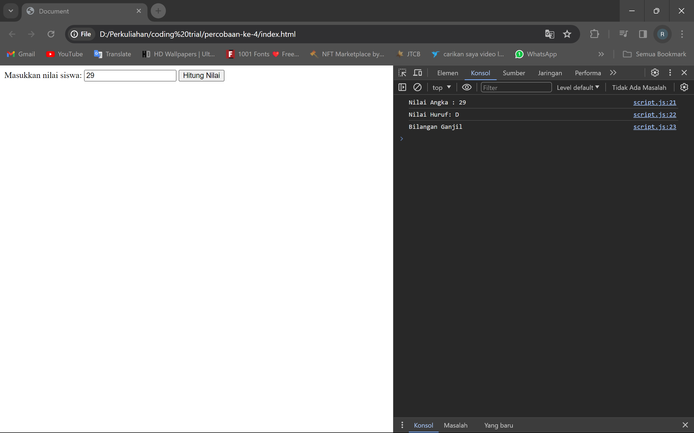

# Portfolio
#### Presented by : Muhammad Rafii Firdaus
#### Profile : [linkedin.com/in/rafiii/](https://www.linkedin.com/in/rafiii/)

## Hi, my name is Rafi
Hi, I am Rafii Firdaus, I am a technology enthusiast and I am currently a student majoring in Informatics Engineering at Semen Indonesia International University.

I am always looking for opportunities that allow me to use my interest in technology and AI and also to build relationships while allowing me to explore and learn.

I actively learn outside the curriculum and am excited to participate in small projects. I believe in the value of teamwork and collaboration. With a high passion for learning, I hope to contribute positively in the world of technology.

## Projects
### My First Project with HTML
[Publication](https://github.com/RfiiF/My-first-project)

This is my first project using **HTML**. So a week ago I attended a mini bootcamp on front-end developers. The bootcamp was held for 4 days. In the bootcamp I was taught about the basics of css, html, and javascript. On the last day there was an assignment related to html and javascript. I created an html program by inputting a value between 1 and 100 and later the program will display the output on the console in the form of a number value, a letter value in the form of A, B, C, D (according to the grade classification), and identify whether the value is included in an even number or an odd number.

Thanks to dibimbing.id
#DigitalSkillFair23 #Dibimbing

### My First Project Using Flowgorithm

