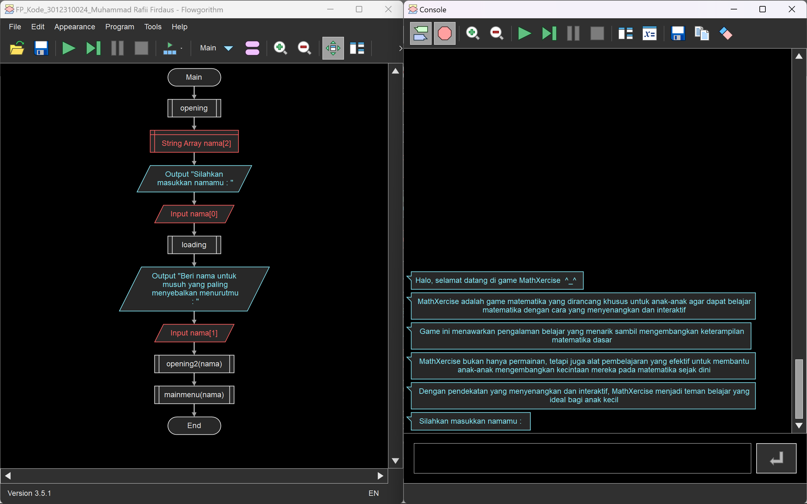
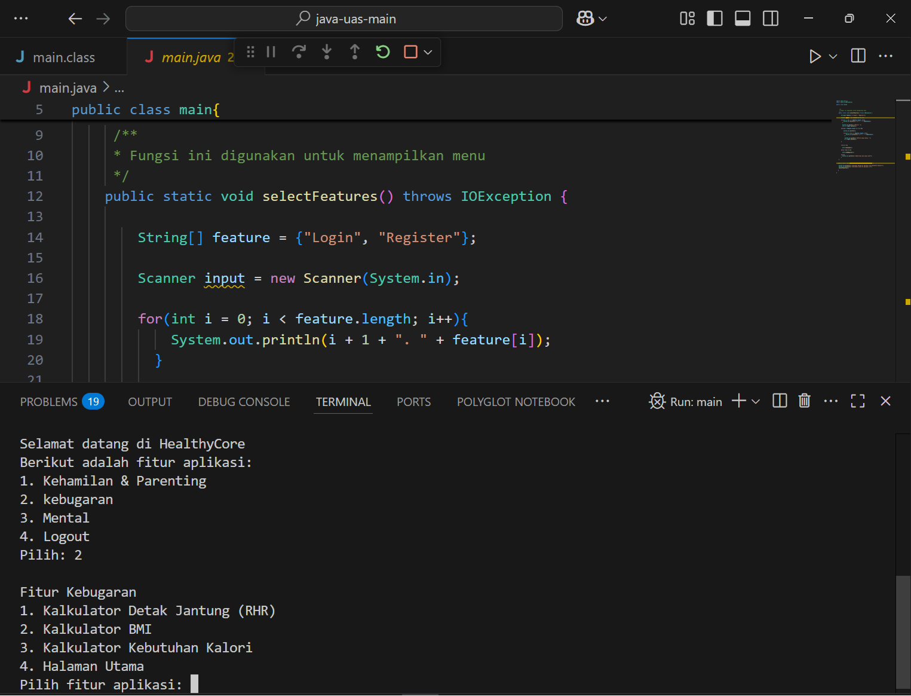
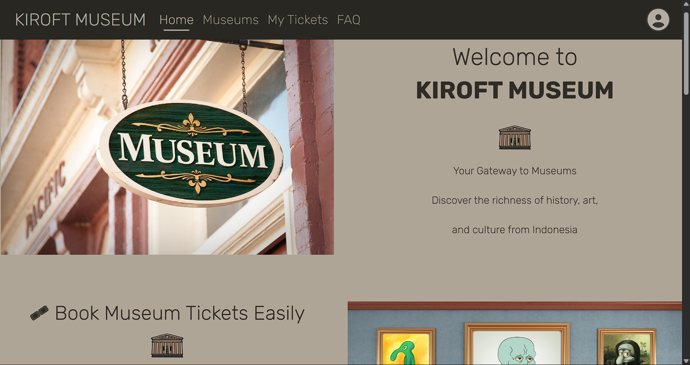

# Portfolio
#### Presented by: Muhammad Rafii Firdaus
#### Profile : [linkedin.com/in/rafiii/](https://www.linkedin.com/in/rafiii/)

## Hi, my name is Rafi
Hi, I am Rafi Firdaus. I am a technology enthusiast, and I am currently a student majoring in Informatics Engineering at Semen Indonesia International University.

I am always looking for opportunities that allow me to utilize my interest in technology and AI, while also building relationships and exploring and learning.

I actively engage in learning outside the curriculum and am excited to participate in small projects. I believe in the value of teamwork and collaboration. With a high passion for learning, I hope to contribute positively to the world of technology.

## Projects
### My First Project with HTML
[Publication](https://github.com/RfiiF/My-first-project)

This is my first project using **HTML**. So a week ago I attended a mini bootcamp on front-end developers. The bootcamp was held for 4 days. In the BootCamp, I was taught about the basics of **CSS, HTML, and JavaScript**. On the last day, there was an assignment related to **HTML and JavaScript**. I created an html program by inputting a value between 1 and 100 and later the program will display the output on the console in the form of a number value, a letter value in the form of A, B, C, D (according to the grade classification), and identify whether the value is included in an even number or an odd number.

Thanks to dibimbing.id
#DigitalSkillFair23 #Dibimbing

-----------------------------------------------------------------------------------------------------------------------------------------------------------

### My First Project Using Flowgorithm
[Publication](https://github.com/RfiiF/Game-MathXercise)

This is my first project using **Flowgorithm**. Here I try to make a game called MathXercise.
MathXercise is a math game specially designed for kids to learn math in a fun and interactive way. This game offers an engaging learning experience while developing basic math skills.
MathXercise is not just a game, but also an effective learning tool to help children develop their love for math early on. With its fun and interactive approach, MathXercise makes an ideal learning companion for young children.

You can try playing the game by opening it using **Flowgorithm** :)

--------------------------------------------------------------------------------------------------------------------------------------------------------

### My First Java Project
[Publication](https://github.com/RfiiF/HealthyCore)

HealthyCore is a comprehensive digital health program covering pregnancy & parenting, fitness, and mental health. Here, you can calculate your RHR (resting heart rate), BMI, and calorie needs. Not only that, but there are also features to check stress levels, anxiety disorders, and for early detection of depression. This program can even help calculate children's protein needs and detect iron deficiency anemia in kids.

This was my first Java programming project, and it served as my final assignment for semester 2. I worked on it with my friend [Faiz Nurullah](https://www.linkedin.com/in/faiznurullah/) , who's awesome at developing projects. I learned a lot from him, from authentication systems, adding accounts, to login and registration. This experience was truly invaluable!

You can try to run the program using Visual Studio Code, then run main.java

---------------------------------------------------------------------------------------------------------------------------------------------------------

### My First Laravel Project
[Publication](https://github.com/RafiiFirdaus/KiroftMuseum)

Kiroft Museum is a modern website built using Laravel version 12 to facilitate online museum ticket booking. The app provides a seamless user experience to explore various museums in Indonesia, make bookings, and manage their tickets. This website aims to digitize the museum ticket booking system.
Provide complete information about museums in Indonesia, Simplify the booking and payment process, and Enhance the cultural tourism experience.

This was my first Laravel Blade project, and it served as my final assignment for semester 4. I completed this website with the help of my friends [Alicya Khusnul]() and [Hilda Kholifah](https://www.linkedin.com/in/rahmadani-hilda-kholifah-4a15712a4/) . They are very collaborative and passionate about this website project. I thank them very much for helping me with this website project.

--------------------------------------------------------------------------------------------------------------------------------------------------------

## Visit me on :
LinkedIn : [https://www.linkedin.com/in/rafiii/](https://www.linkedin.com/in/rafiii/)

Instagram : [https://www.instagram.com/raafi.i2/](https://www.instagram.com/raafi.i2/)
