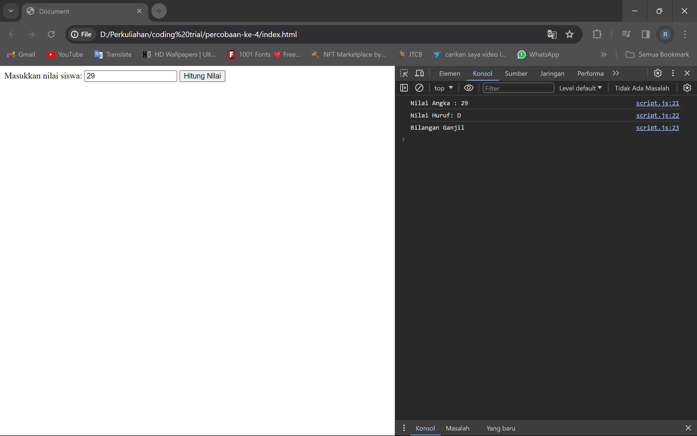
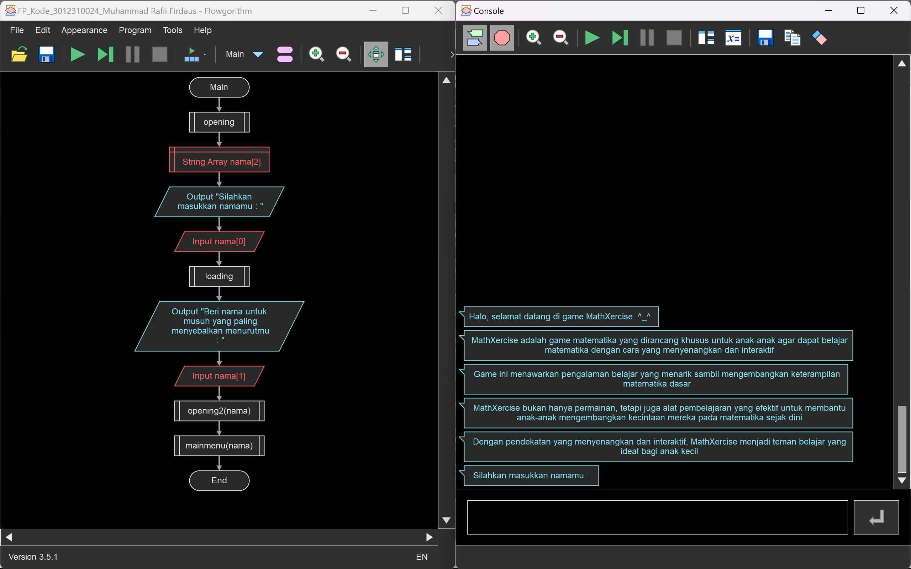
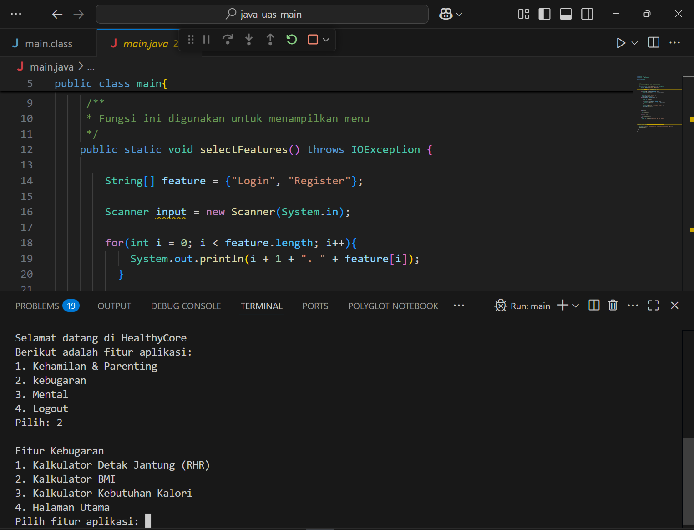
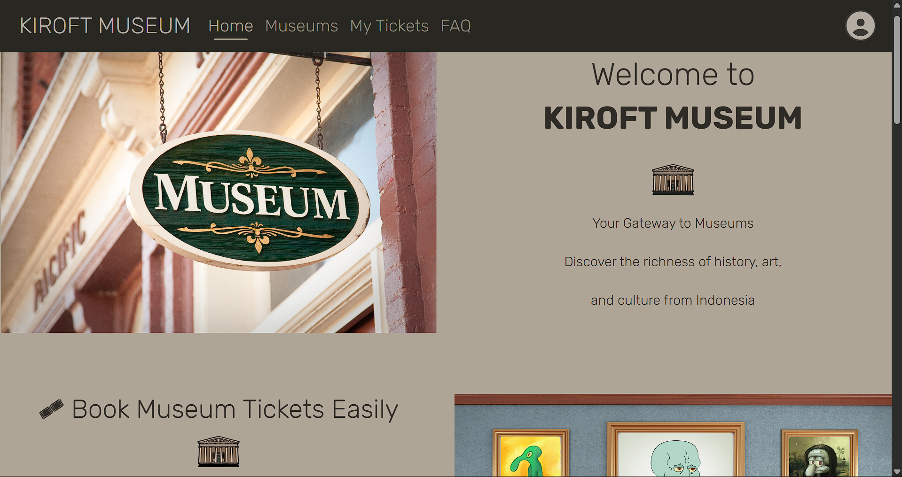
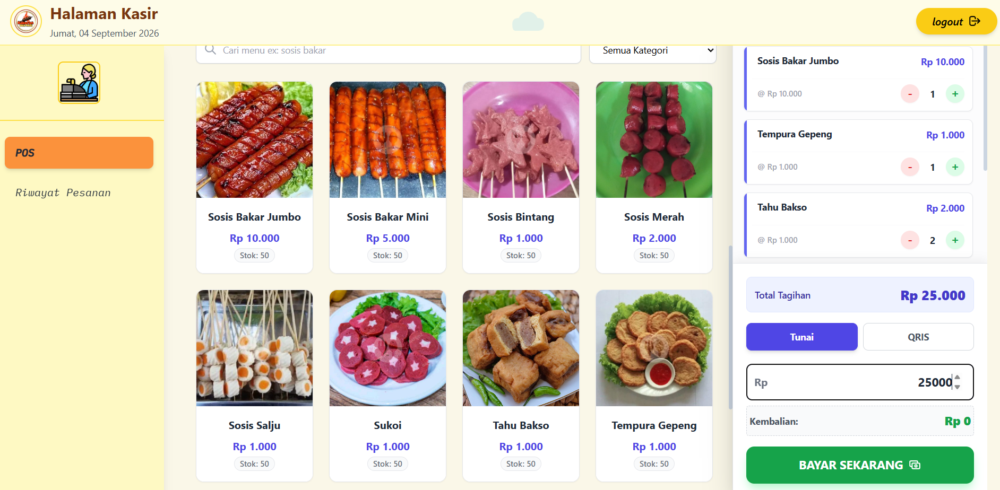
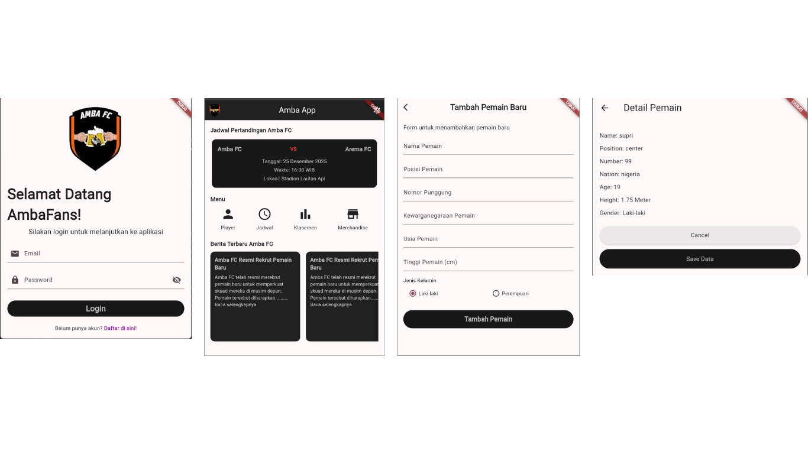
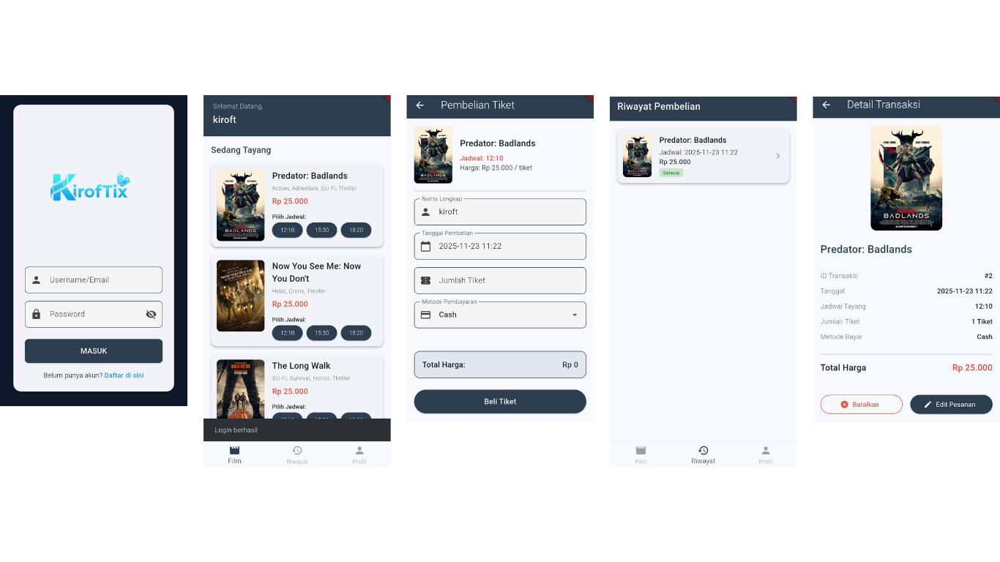

# Portfolio
#### Presented by: Muhammad Rafii Firdaus
#### Profile : [linkedin.com/in/rafiii/](https://www.linkedin.com/in/rafiii/)

## Hi, my name is Rafi
Hi, I am Rafi Firdaus. I am a technology enthusiast, and I am currently a student majoring in Informatics Engineering at Semen Indonesia International University.

I am always looking for opportunities that allow me to utilize my interest in technology and AI, while also building relationships and exploring and learning.

I actively engage in learning outside the curriculum and am excited to participate in small projects. I believe in the value of teamwork and collaboration. With a high passion for learning, I hope to contribute positively to the world of technology.

## Projects
### My First Project with HTML
[Publication](https://github.com/RfiiF/My-first-project)

This is my first project using **HTML**. So a week ago I attended a mini bootcamp on front-end developers. The bootcamp was held for 4 days. In the BootCamp, I was taught about the basics of **CSS, HTML, and JavaScript**. On the last day, there was an assignment related to **HTML and JavaScript**. I created an html program by inputting a value between 1 and 100 and later the program will display the output on the console in the form of a number value, a letter value in the form of A, B, C, D (according to the grade classification), and identify whether the value is included in an even number or an odd number.

Thanks to dibimbing.id\
#DigitalSkillFair23 #Dibimbing

-----------------------------------------------------------------------------------------------------------------------------------------------------------

### My First Project Using Flowgorithm
[Publication](https://github.com/RfiiF/Game-MathXercise)

This is my first project using **Flowgorithm**. Here I try to make a game called MathXercise.
MathXercise is a math game specially designed for kids to learn math in a fun and interactive way. This game offers an engaging learning experience while developing basic math skills.
MathXercise is not just a game, but also an effective learning tool to help children develop their love for math early on. With its fun and interactive approach, MathXercise makes an ideal learning companion for young children.

You can try playing the game by opening it using **Flowgorithm** :)

--------------------------------------------------------------------------------------------------------------------------------------------------------

### My First Java Project
[Publication](https://github.com/RfiiF/HealthyCore)

HealthyCore is a comprehensive digital health program covering pregnancy & parenting, fitness, and mental health. Here, you can calculate your RHR (resting heart rate), BMI, and calorie needs. Not only that, but there are also features to check stress levels, anxiety disorders, and for early detection of depression. This program can even help calculate children's protein needs and detect iron deficiency anemia in kids.

This was my first Java programming project, and it served as my final assignment for semester 2. I worked on it with my friend [Faiz Nurullah](https://www.linkedin.com/in/faiznurullah/) , who's awesome at developing projects. I learned a lot from him, from authentication systems, adding accounts, to login and registration. This experience was truly invaluable!

You can try to run the program using Visual Studio Code, then run main.java

---------------------------------------------------------------------------------------------------------------------------------------------------------

### My First Laravel Project
[Publication](https://github.com/RafiiFirdaus/KiroftMuseum)

Kiroft Museum is a modern website built using Laravel version 12 to facilitate online museum ticket booking. The app provides a seamless user experience to explore various museums in Indonesia, make bookings, and manage their tickets. This website aims to digitize the museum ticket booking system.
Provide complete information about museums in Indonesia, Simplify the booking and payment process, and Enhance the cultural tourism experience.

This was my first Laravel Blade project, and it served as my final assignment for semester 4. I completed this website with the help of my friends [Alicya Khusnul]() and [Hilda Kholifah](https://www.linkedin.com/in/rahmadani-hilda-kholifah-4a15712a4/) . They are very collaborative and passionate about this website project. I thank them very much for helping me with this website project.

--------------------------------------------------------------------------------------------------------------------------------------------------------

### “Bakaran Dua Hati” Cashier Website
[Publication](https://github.com/Desphyr/WebsiteKasir)

This is the result of our final project during the 5th semester. This project is closely related to the courses in software engineering, software requirements analysis, and software project management. The project was carried out by four students, including myself as the project manager, [Dimas Setiawan](https://www.linkedin.com/in/dimas-setiawan-a03218212/) as the system analyst, [Rimbhiato Aurindra](https://www.linkedin.com/in/rimbhiatho-aurindra-9a89902a2/) as the UI/UX designer, and [Achmad Royhan Abdillah](https://www.linkedin.com/in/achmad-royhan-abdillah/) as the programmer. Everyone on my team fulfilled their respective roles. We developed this project in collaboration with our client, the owner of the small and medium-sized enterprise (SME) “Bakaran Dua Hati.” We designed the project according to the client’s preferences, from color selection and design to the features included in this point-of-sale website. Our client found this project helpful because their business has begun using digital devices and services to streamline in-store product sales transactions.

Thank you to all the members of my team. You can visit their GitHub profiles below.\
[Achmad Royhan Abdillah](https://github.com/Desphyr)\
[Dimas Setiawan](https://github.com/dimassyz)\
[Rimbhiatho Aurindra](https://github.com/Rimbhiatho)

---------------------------------------------------------------------------------------------------------------------------------------------------------

### My First Flutter Project
[Publication](https://github.com/RafiiFirdaus/AplikasiBola_0024)

This is my first Flutter project. Here, I’m trying to build a mobile app that allows users to add soccer players. The app is very simple; it only features a home screen, and its content is still a work in progress. I created this app for an assignment in my mobile app programming course. On the home screen, there are features for logging in and registering an account. After that, the user is taken to the home screen. To add a new player, the user simply clicks the “Player” button. This will take them to the “Add New Player” page. After the user fills in all the player’s information, they will be redirected to the “Player Details” page.

---

### "KirofTix" - Movie Ticket Booking App
[Publication](https://github.com/RafiiFirdaus/utspam_IF-5B_0024_film)

KirofTix is a Flutter (Dart)-based mobile app designed to make booking movie tickets convenient, featuring full CRUD operations implemented using the local Sqflite database. The app includes a secure authentication system with strict input validation, a dashboard page displaying a list of movies and their showtimes, and a real-time ticket price calculation feature that supports various payment methods. Through transaction history management, users can view securely masked order details (****), update the number of tickets, and instantly cancel orders, utilizing the intl and path_provider libraries for optimal data management.

This app was created to fulfill the midterm exam requirement for a mobile app programming course. 

---

## Visit me on :
LinkedIn : [https://www.linkedin.com/in/rafiii/](https://www.linkedin.com/in/rafiii/)

Instagram : [https://www.instagram.com/raafi.i2/](https://www.instagram.com/raafi.i2/)
